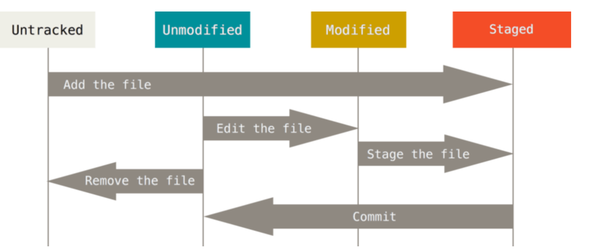
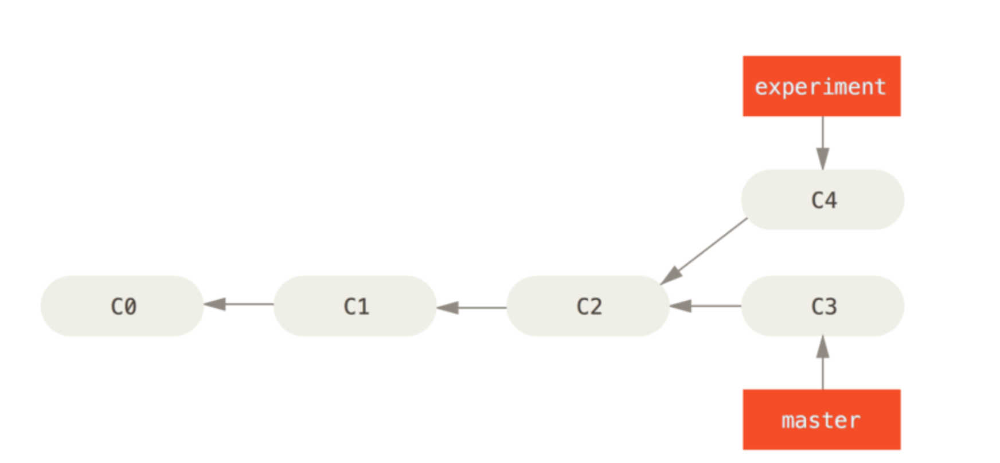

# Git入门到高级教程

## 为什么要进行项目文件的版本管理

1. 代码备份和恢复
1. 团队开发和协作流程
1. 项目分支管理和备份

## git 是什么？

git是一个分布式的版本控制软件。版本控制是一种记录一个或若干文件内容变化，以便将来查阅特定版本修订情况的系统。

最初由林納斯·托瓦茲創作，於2005年以GPL釋出。最初目的是為更好地管理Linux內核開發而設計。

> 2005年，安德鲁·垂鸠写了一个简单程序，可以连接BitKeeper的存储库，BitKeeper著作权拥有者拉里·麦沃伊认为安德鲁·垂鸠对BitKeeper内部使用的协议进行逆向工程，决定收回无偿使用BitKeeper的许可。Linux内核开发团队与BitMover公司进行磋商，但无法解决他们之间的歧见。林纳斯·托瓦兹决定自行开发版本控制系统替代BitKeeper，以十天的时间，编写出第一个git版本.

## 集中式和分布式版本控制软件

### 集中式版本控制软件

集中化的版本控制系统（`Centralized Version Control Systems`，简称 `CVCS`）应运而生。 这类系统，诸如 `CVS`、`Subversion` 以及 `Perforce` 等，都有一个单一的集中管理的服务器，保存所有文件的修订版本，而协同工作的人们都通过客户端连到这台服务器，取出最新的文件或者提交更新。

集中式管理的缺点：

1. 中央服务器的单点故障，导致整个版本管理瘫痪
1. 中央服务器故障导致所有的版本丢失
1. 当客户端和服务器端无法进行网络连接的时，客户端无法进行提交代码和保存版本，也不能恢复某个版本


### 分布式版本控制软件

分布式版本控制系统（`Distributed Version Control System`，简称 `DVCS`）.分布式就是每个人都有一份完整的仓库版本，提交和管理都是在本地进行，当然也可以进行远程的仓库之间进行合并提交等操作。


## git 安装

### Linux 上安装

如果你想在 Linux 上用二进制安装程序来安装 Git，可以使用发行版包含的基础软件包管理工具来安装。 如果 以 Fedora 上为例，你可以使用 yum:

```sh
$ sudo yum install git
```

如果你在基于 Debian 的发行版上，请尝试用 apt-get: 

```sh
$ sudo apt-get install git
```
要了解更多选择，Git 官方网站上有在各种 Unix 风格的系统上安装步骤，网址为 [http://git-scm.com/download/linux](http://git-scm.com/download/linux)。

### 在 Mac 上安装

方法一：

最简单的方法是安装 `Xcode Command Line Tools`,然后在 Terminal 里尝试首次运行 git 命令即可。 如果没有安装过命令行开发者工具，将会提示 你安装。

方法二：（推荐）

使用 [homebrew](https://github.com/mxcl/homebrew)

```sh
$ brew install git
```

### windows上安装

直接下载安装包：[https://gitforwindows.org/](https://gitforwindows.org/)

### 检测是否安装成功

windows请从开始菜单程序中打开`gitbash`,其他系统请打开终端工具或者shell命令行工具。

```sh
$ git --version

# 输出，仅供参考
git version 2.18.0
```

## git 快速上手和配置

### 用户名和邮箱配置

当安装完 Git 应该做的第一件事就是设置你的用户名称与邮件地址。 这样做很重要，因为每一个 Git 的提交都会 使用这些信息，并且它会写入到你的每一次提交中。

windows请从开始菜单程序中打开`gitbash`,其他系统请打开终端工具或者shell命令行工具。

```sh
$ git config --global user.name "aicoder"
$ git config --global user.email laoma@aicoder.com
```

**请把用户名和邮箱换成你自己的**

> 如果使用了 --global 选项，那么该命令只需要运行一次，因为之后无论你在该系统上做任何事 情， Git 都会使用那些信息。 当你想针对特定项目使用不同的用户名称与邮件地址时，可以在那个项目目录下运 行没有 --global 选项的命令来配置。

以上配置完成后，检测是否配置成功：

```sh
$ git config --list

# 输出以下内容，仅供参考
credential.helper=osxkeychain
user.name=aicoder
user.email=laoma@aicoder.com
color.status=auto
...
```

### 配置SSH

`Git` 服务器大部分都使用 `SSH` 公钥进行认证,其他认证方式都不方便，创建`SSH`公钥的方法。

**请打开用gitbash或者终端工具运行以下命令**

默认情况下，用户的 `SSH` 密钥存储在其 `~/.ssh` 目录下。 进入该目录并列出其中内容，你便可以快 速确认自己是否已拥有密钥:

```sh
$ cd ~/.ssh
$ ls
authorized_keys2  id_dsa       known_hosts
config            id_dsa.pub
```

> cd命令可以帮助我们进入系统的某个目录。 ls命令可以列出当前目录下面的所有文件和文件夹的信息。

如果已经存在`id_dsa`、`id_dsa.pub`，说明就已经生成果，后面的步骤可以省略。

> id_dsa 或 id_rsa 命名的文件，其中一个带有 .pub 扩展名。 .pub 文件是你的公钥，另 一个则是私钥。

```sh
  $ ssh-keygen

  # 一路回车回车即可，以下为输出内容，仅供参考
  Generating public/private rsa key pair.
  Enter file in which to save the key (/home/schacon/.ssh/id_rsa):
  Created directory '/home/schacon/.ssh'.
  Enter passphrase (empty for no passphrase):
  Enter same passphrase again:
  Your identification has been saved in /home/schacon/.ssh/id_rsa.
  Your public key has been saved in /home/schacon/.ssh/id_rsa.pub.
  The key fingerprint is:
  d0:82:24:8e:d7:f1:bb:9b:33:53:96:93:49:da:9b:e3 schacon@mylaptop.local
```

首先 ssh-keygen 会确认密钥的存储位置(默认是 .ssh/id_rsa)，然后它会要求你输入两次密钥口令。如 果你不想在使用密钥时输入口令，将其留空即可。

## git基本操作

### 在现有目录中初始化仓库

```sh
$ cd /path/to/init
$ git init
```

此时在目录中将创建一个名为 `.git` 的子目录,这里面存放当前仓库的所有的跟踪的信息。

此时当前文件夹下面的所有的文件都没有被跟踪，如果需要跟踪变化，必须添加到跟踪的参考中。

### 添加文件和提交信息

`git add 文件` 命令可以帮祝我们让git帮忙跟踪具体的文件。然后执行`git commit`提交信息，相当于确认跟踪。

```sh
$ git add ./*.js
$ git add a.txt
$ git commit -m 'first commit'
```

> 提交记录的时候必须添加消息，而且添加的消息还有一定的规范，每个公司的提交消息规范不一样，视情况而定。

参考：[你可能会忽略的 Git 提交规范](https://juejin.im/entry/5b429be75188251ac85830ff)

### 工作区和暂存区

- 工作区（Working Directory）

工作区，也称为工作目录，也就是要进行版本管理的文件夹。

- 暂存区（Stage或者Index）

暂时存放将要记录修改版本的文件的区域。


工作目录下的每一个文件都不外乎这两种状态:已跟踪或未跟踪。

`git add`可以把文件加入暂存区。
`git commit`命令可以把暂存区的文件更新变化记录到版本库中永久保存。

不在暂存区的文件，不会被追踪。



> 暂存区和版本库存放在 .git目录中。

### 检查当前文件状态

要查看哪些文件处于什么状态，可以用 git status 命令。 如果在克隆仓库后立即使用此命令，会看到类似这 样的输出:

```sh
$ git status
```

以下是没有任何修改和暂存的情况：

```sh
On branch master
Your branch is up to date with 'origin/master'.

nothing to commit, working tree clean
```

以下是有修改未提交，有新增加为加入暂存区的情况：

```sh
On branch master
Your branch is up to date with 'origin/master'.

Changes not staged for commit:
  (use "git add <file>..." to update what will be committed)
  (use "git checkout -- <file>..." to discard changes in working directory)

        modified:   docs/pages/vip_3git.md

Untracked files:
  (use "git add <file>..." to include in what will be committed)

        docs/images/0.jpeg
        docs/images/zc.png

no changes added to commit (use "git add" and/or "git commit -a")
```

### **状态简览**

`git status` 命令的输出十分详细，但其用语有些繁琐。 如果你使用 `git status -s` 命令或 `git status --short`命令，你将得到一种更为紧凑的格式输出。运行`git status -s`，状态报告输出如下:

```sh
$ git status -s
M README
MM Rakefile
A  lib/git.rb
M  lib/simplegit.rb
?? LICENSE.txt
```

### 查看文件的日志

`git log`命令帮助我们输出git的所有操作日志。

```sh
$ git log
commit ca82a6dff817ec66f44342007202690a93763949
Author: Scott Chacon <schacon@gee-mail.com>
Date:   Mon Mar 17 21:52:11 2008 -0700
    changed the version number
commit 085bb3bcb608e1e8451d4b2432f8ecbe6306e7e7
Author: Scott Chacon <schacon@gee-mail.com>
Date:   Sat Mar 15 16:40:33 2008 -0700
    removed unnecessary test
commit a11bef06a3f659402fe7563abf99ad00de2209e6
Author: Scott Chacon <schacon@gee-mail.com>
Date:   Sat Mar 15 10:31:28 2008 -0700
first commit
```

> 按q键可以退出查看日志，回车键查看更多。

- 查看修改的差异

`git log -p`

- 查看最近两次的差异

`git log -p -2`

- 查看每次提交的总结 

正如你所看到的，`--stat` 选项在每次提交的下面列出所有被修改过的文件、有多少文件被修改了以及被修改过 的文件的哪些行被移除或是添加了。 在每次提交的最后还有一个总结。

`git log --stat`

- 在一行内显示日志

`git log --oneline`

- 图形化输出

`git log --graph`

其他参数

选项|说明
---|---
-p|按补丁格式显示每个更新之间的差异。
--stat|显示每次更新的文件修改统计信息。
--shortstat|只显示 --stat 中最后的行数修改添加移除统计。
--name-only|仅在提交信息后显示已修改的文件清单。
--name-status|显示新增、修改、删除的文件清单。
--abbrev-commit|仅显示 SHA-1 的前几个字符，而非所有的 40 个字符。
--relative-date|使用较短的相对时间显示(比如，“2 weeks ago”)。
--graph|显示 ASCII 图形表示的分支合并历史。
--pretty|使用其他格式显示历史提交信息。可用的选项包括 oneline，short，full，fuller 和 format(后跟指定格式)

### 取消新添加文件的暂存状态

如果你不小心添加了一个文件，但本不想让它进行跟踪管理，仅仅是临时使用，那么怎样才能从暂存区取消呢？

```sh
# 进入项目目录
$ cd /path/to
# 添加一个文件
$ touch a.txt
# 添加到暂存区
$ git add a.txt
```

此时查看git的情况：

```sh
$ git status
# 查看当前文件，在暂存区等待提交。
On branch master
Your branch is up to date with 'origin/master'.

Changes to be committed:
  (use "git reset HEAD <file>..." to unstage)

  new file:   a.txt
```

取消暂存：

```sh
$ git reset HEAD a.txt
$ git status
# 可以看到a.txt是未跟踪状态了。
```

### 取消已经跟踪文件的暂存状态

如果一个文件已经被跟踪过了，而且已经修改后被add到了暂存区现在想取消修改暂存状态。

```sh
$ git reset HEAD a.txt
$ git checkout -- a.txt
```

> git checkout -- [file]是一个危险的命令。你对那个文件做的任何修改都会消失 - 你只是拷贝了另一个文件来覆盖它。

全部回滚：

```sh
git reset --hard HEAD
```

**`--hard` 会让工作目录也会回滚到未修改之前的状态。**

### 回滚到上一个提交点

回滚到上一次提交，并且添加一次新的提交，提交信息不变。

```sh
# 然后HEAD指针回滚到上一次提交
$ git reset --soft HEAD^
$ git commit -a -m 'new commit'

# 类似于
$ git add .
$ git commit --amend
```

> 上一次提交：HEAD^, 上两次： HEAD~2  上三次： HEAD~3 ...    最好不要这么用！！！

### 回滚文件

让某个文件回滚到某个版本的状态。

```sh
$ git checkout -- filepath
```

### 忽略文件

一般我们总会有些文件无需纳入 Git 的管理，也不希望它们总出现在未跟踪文件列表。 通常都是些自动生成的文 件，比如日志文件，或者编译过程中创建的临时文件等。 在这种情况下，我们可以创建一个名为 `.gitignore` 的文件，列出要忽略的文件模式。

我们再看一个 .gitignore 文件的例子: '

```sh
# no .a files
*.a
# but do track lib.a, even though you're ignoring .a files above
!lib.a
# only ignore the TODO file in the current directory, not subdir/TODO
/TODO
# ignore all files in the build/ directory
build/
# ignore doc/notes.txt, but not doc/server/arch.txt
doc/*.txt
# ignore all .pdf files in the doc/ directory
doc/**/*.pdf
```

一般此文件会放到工作目录的根目录下，此文件中匹配的所有文件都会被git所有的命令忽略。

## git分支管理

项目分支就是版本库的一个副本，有了分支后可以把你的工作从开发主线上分离开来， 以免影响开发主线。

### 创建分支

创建分支： `git branch  分支名字`命令，切换分支的命令使用 `git checkout 分支名字`

```sh
$ git branch dev
$ git checkout

# -b创建分支，checkout是切换分支
$ git checkout -b dev
```

### 删除分支

当一个分支完成了使命的时候，一般我们会把它删除掉。

```sh
# -d 命令是删除的意思，delete
$ git branch -d hotfix
```

### 查看所有的分支

```sh
$ git branch -v
  dev    eba9a31 update the a.txt by dev
* master d47fbfb update the a.txt by master;
```

带*的代表是当前的分支。

### 合并分支

合并分支就是把其他分支的代码合并到当前的分支中。git会自动将当前分支和要合并的分支找到共同的基点，然后将当前分支的所有变化和要合并分支的变化进行三方合并，并产生一个新的提交，此次提交有两个父提交。

例如操作：

```sh
# 进入主分支
$ git checkout master

# 合并dev分支
$ git merge dev
```

合并分支：

- 快速合并： 如果两个分支之间没有分叉，要被合并的分支提交比当前分支更新，那么只是HEAD指针的移动。

- 冲突解决： 如果合并的两个分支有分叉，那么自动添加一个新的提交，如果有冲突需要先解决完冲突然后再提交。

解决冲突的办法：就是移除代码中的特殊符号，留下自己想要的代码。比如：冲突文件如下：

```sh
ssss
<<<<<<< HEAD
22222222
33333333
44444444
=======
devdevdevdev
>>>>>>> dev
```

移除上面的 `<<<<<<< HEAD`  和  `=======`  `>>>>>>> dev`然后留下自己想要的代码就完成了冲突解决，最后add和commit一下就可以了。

完整的解决冲突的流程：

```sh
# 切换到主分支
$ git checkout master

# 把dev分支的内容合并到主分支
$ git merge dev

# 如果产生冲突后,先修改文件，去掉冲突的符号。

# 最后提交修改到仓库
$ git add .
$ git commit -m '合并冲突'
```

## git标签

Git 可以给历史中的某一个提交打上标签。 比较有代表性的是人 们会使用这个功能来标记发布结点(v1.0 等等)。

### 列出标签

在 Git 中列出已有的标签是非常简单直观的。 只需要输入 `git tag`:

```sh
$ git tag
v0.1
v1.3
```

> 这个命令以字母顺序列出标签;    

你也可以使用特定的模式查找标签,如果只对 1.8.5
系列感兴趣，可以运行:

```sh
$ git tag -l 'v1.8.5*'
v1.8.5
v1.8.5-rc0
v1.8.5-rc1
v1.8.5-rc2
v1.8.5-rc3
v1.8.5.1
v1.8.5.2
v1.8.5.3
v1.8.5.4
v1.8.5.5
```

### 创建标签

Git 使用两种主要类型的标签:轻量标签(lightweight)与附注标签(annotated)。 一个轻量标签很像一个不会改变的分支 - 它只是一个特定提交的引用。

- 注标签

在 Git 中创建一个附注标签是很简单的。 最简单的方式是当你在运行 tag 命令时指定 -a 选项:

```sh
$ git tag -a v1.4 -m 'my version 1.4'
$ git tag
v0.1
v1.3
v1.4
```

> -m 选项指定了一条将会存储在标签中的信息。

通过使用git show命令可以看到标签信息与对应的提交信息:

```sh
$ git show v1.4
tag v1.4
Tagger: Ben Straub <ben@straub.cc>
Date:   Sat May 3 20:19:12 2014 -0700
my version 1.4
commit ca82a6dff817ec66f44342007202690a93763949
Author: Scott Chacon <schacon@gee-mail.com>
Date:   Mon Mar 17 21:52:11 2008 -0700
  changed the version number
```

输出显示了打标签者的信息、打标签的日期时间、附注信息，然后显示具体的提交信息。 

- 轻量标签

另一种给提交打标签的方式是使用轻量标签。 轻量标签本质上是将提交校验和存储到一个文件中 - 没有保存任 何其他信息。 创建轻量标签，不需要使用 -a、-s 或 -m 选项，只需要提供标签名字:

```sh
$ git tag v1.4-lw
$ git tag
v0.1
v1.3
v1.4
v1.4-lw
v1.5
```

### 后期打标签

你也可以对过去的提交打标签。

```sh
$ git tag -a v1.2 9fceb02
```

### 检出标签

在 Git 中你并不能真的检出一个标签，因为它们并不能像分支一样来回移动。 如果你想要工作目录与仓库中特定 的标签版本完全一样，可以使用git checkout -b [branchname] [tagname]在特定的标签上创建一个 新分支:

```sh
$ git checkout -b version2 v2.0.0
Switched to a new branch 'version2'
```

当然，如果在这之后又进行了一次提交，version2 分支会因为改动向前移动了，那么 version2 分支就会和 v2.0.0 标签稍微有些不同，这时就应该当心了。

## 变基

rebase 命令将提交到某一分支上的所有修改都移至另一分支上，就好像“重新 播放”一样。翻译成通俗的话： 找到参照的仓库和当前的仓库的相同的提交，然后把当前分支后续的提交挪动到参照仓库的提交的最后，形成一条线性的提交顺序。

例如：experiment分支参照master分支进行变基



```sh
$ git checkout experiment
$ git rebase master
```


> 远程分支的pull命令的时候的--base可以直接变基合并

## git远程仓库

### 远程分支克隆

### 远程分支下载

### 远程分支拉取

### 远程分支合并和变基

## git工作流

### git集中式工作流

### git分布式工作流

## git的钩子

## git自动化集成

## github

## git其他

### git命令别名

Git 并不会在你输入部分命令时自动推断出你想要的命令。 如果不想每次都输入完整的 Git 命令，可以通过 git
config 文件来轻松地为每一个命令设置一个别名。 这里有一些例子你可以试试:

```sh
$ git config --global alias.co checkout
$ git config --global alias.br branch
$ git config --global alias.ci commit
$ git config --global alias.st status
```
