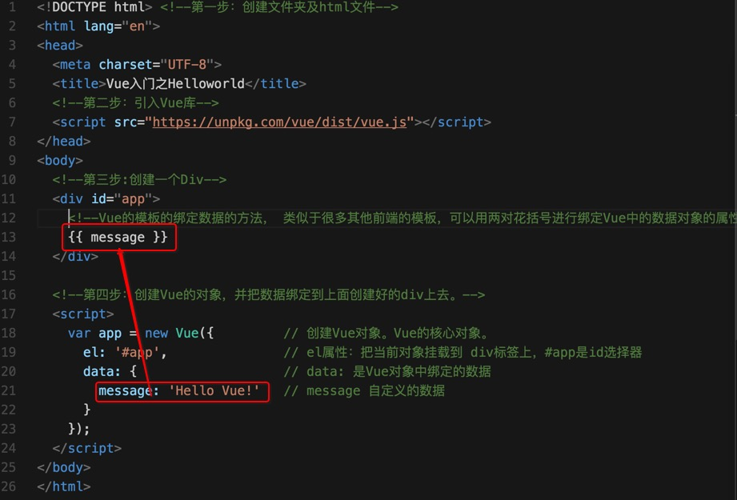

# Vue 入门之概念及 Helloworld

## Vue 简介

`Vue`是一个前端的双向绑定类的框架，发音[读音 /vjuː/, 类似于 [view]。新的 Vue 版本参考了 React 的部分设计，当然也有自己独特的地方，比如 Vue 的单文件组件开发方式都很有创新，另外 Vue 自身的一些绑定的语法、用法等都非常精炼，很容易上手，而且第三方的插件都非常丰富，社区非常活跃，最新的文档都有中文版本。而且 Vue 配合官方的和第三方的库可以实现单文件的组件化开发、SPA 等现代化前端开发。  
详情请参考[Vue 官网](https://cn.vuejs.org/)

## Vue 的入门 demo

`Vue` 可以直接把它当做一个 js 库使用，所以它可以很容易的接入到你的项目或者单个页面中。甚至你可以只使用它的双向绑定功能。所以它很容易上手。

比如：我们有一个需求，一个网页上一个 Div 标签，我们有一个 json 对象存储数据，把 json 对象上的数据放到 Div 上去。

接下来是步骤：

```
第一步： 创建一个文件夹并创建一个html文件 比如：index.html.
当如你可以选择你自己的编辑器，我就用VSCode。

第二步：引入Vue库
<script src="https://unpkg.com/vue/dist/vue.js"></script>
当然了你可以直接下载Vue的js文件，推荐你直接用上面的cdn即可。

第三步：创建一个Div，给它一个id，比如：app

第四步：创建Vue的对象，并把数据绑定到上面创建好的div上去。
```

最终的代码如下：

```html
<!DOCTYPE html> <!--第一步：创建文件夹及html文件-->
<html lang="en">
<head>
  <meta charset="UTF-8">
  <title>Vue入门之Helloworld</title>
  <!--第二步：引入Vue库-->
  <script src="https://unpkg.com/vue/dist/vue.js"></script>
</head>
<body>
  <!--第三步:创建一个Div-->
  <div id="app">
    <!--Vue的模板的绑定数据的方法， 类似于很多其他前端的模板，可以用两对花括号进行绑定Vue中的数据对象的属性 -->
    {{ message }}
  </div>

  <!--第四步：创建Vue的对象，并把数据绑定到上面创建好的div上去。-->
  <script>
    var app = new Vue({         // 创建Vue对象。Vue的核心对象。
      el: '#app',               // el属性：把当前Vue对象挂载到 div标签上，#app是id选择器
      data: {                   // data: 是Vue对象中绑定的数据
        message: 'Hello Vue!'   // message 自定义的数据
      }
    });
  </script>
</body>
</html>
```

最终的结果就是：

```html
Hello Vue!
```

---

## Vue 的 Helloworld 总结

- Vue 构造函数的：选项 el 属性，就是 element 缩写，当前 Vue 对象挂载到哪个标签上的语法，支持 CSS 选择器或者 dom 对象，一般用 id 选择器选择当前页面的标签。
- Vue 的选项：data 属性是自定义数据。这里我们只是演示了一个 message 属性，vue 会把自定义的数据可以与 html 的模板数据进行绑定。
- Vue 数据绑定的方式就是用 `{{}}`，类似于 handlebars.
- 上面这个 demo 就是演示了 Vue 的绑定数据的基本模型。注意点，标签先创建好了之后，再创建 Vue 对象，具体你应该懂吧。



# [回到vue.js知识列表首页](/pages/vip_2vue.md)