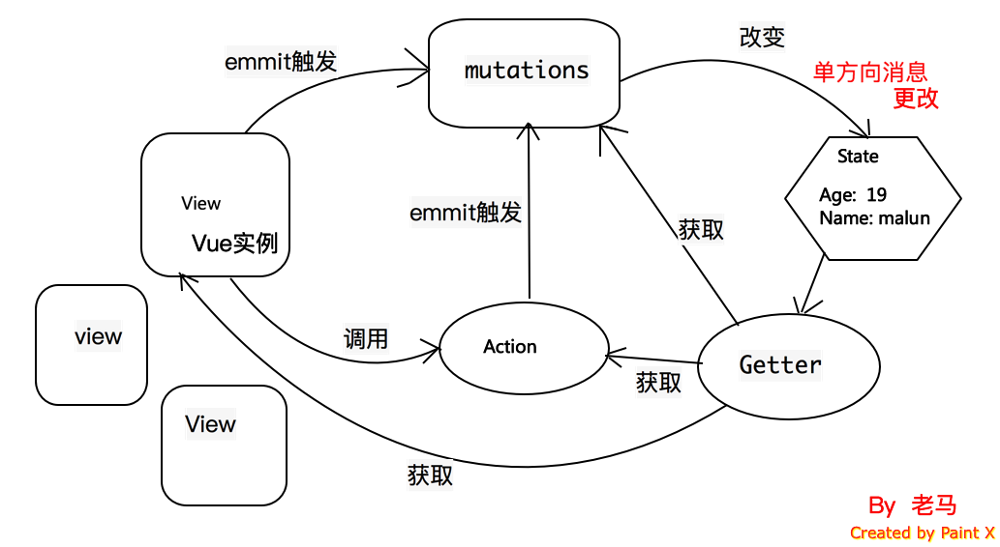

# Vue 入门之 Vuex 实战

## 引言

Vue 组件化做的确实非常彻底，它独有的 vue 单文件组件也是做的非常有特色。组件化的同时带来的是：组件之间的数据共享和通信的难题。
尤其 Vue 组件设计的就是，父组件通过子组件的 prop 进行传递数据，而且数据传递是`单向`的。也就是说：父组件可以把数据传递给子组件，但是
反之则不同。如下图所示：


## 单向数据流动

单方向的数据流动带来了非常简洁和清晰的数据流，纯展示性或者独立性较强的模块的开发确实非常方便和省事。
但是复杂的页面逻辑，组件之间的数据共享处理就会需要通过事件总线的方式解决或者使用 Vue 的 Vuex 框架了。

## 子组件通知父组件数据更新：事件方式的实现

子组件可以在子组件内触发事件，然后在父容器中添加子组件时绑定父容器的方法为事件响应方法的方式.如下图所示：


- 使用 v-on 绑定自定义事件

```
每个 Vue 实例都实现了事件接口(Events interface)，即：
使用 $on(eventName) 监听事件
使用 $emit(eventName) 触发事件
```

参考代码案例：

```html
<!DOCTYPE html>
<html lang="en">

<head>
  <meta charset="UTF-8">
  <title>Vue入门之event message</title>
  <!-- 新 Bootstrap 核心 CSS 文件 -->
  <link rel="stylesheet" href="http://cdn.bootcss.com/bootstrap/3.3.0/css/bootstrap.min.css">

  <!-- 可选的Bootstrap主题文件（一般不用引入） -->
  <link rel="stylesheet" href="http://cdn.bootcss.com/bootstrap/3.3.0/css/bootstrap-theme.min.css">

  <!-- jQuery文件。务必在bootstrap.min.js 之前引入 -->
  <script src="http://cdn.bootcss.com/jquery/1.11.1/jquery.min.js"></script>

  <!-- 最新的 Bootstrap 核心 JavaScript 文件 -->
  <script src="http://cdn.bootcss.com/bootstrap/3.3.0/js/bootstrap.min.js"></script>

  <script src="https://unpkg.com/vue/dist/vue.js"></script>
  <script src="https://unpkg.com/vue-router/dist/vue-router.js"></script>
</head>

<body>
  <div id="app">
    <p>推荐次数：{{ voteCount }}</p>
    <hr>
    <!--绑定两个自定义事件，当组件内部触发了事件后，会自定调用父容器绑定的methods的方法，达到了子容器向父容器数据进行通信同步的方法-->
    <vote-btn v-on:vote="voteAction" v-on:sendmsg="sendMsgAction"></vote-btn>
    <hr>
    <ul class="list-group">
      <li v-for="o in msg" class="list-group-item">{{o}}</li>
    </ul>
  </div>
  <script>
    Vue.component('vote-btn', {
      template: `
        <div>
          <button class="btn btn-success" v-on:click="voteArticle">推荐</button>
          <hr/>
          <input type="text" v-model="txtMsg" />
          <button v-on:click="sendMsg" class="btn btn-success">发送消息</button>
        </div>
      `,
      data: function () {
        return {
          txtMsg: ""
        }
      },
      methods: {
        voteArticle: function () {
          // 触发事件，vote
          this.$emit('vote')
        },
        sendMsg: function () {
          // 触发事件，sendmsg，并
          this.$emit('sendmsg', this.txtMsg)
        }
      }
    })

    var app = new Vue({
      el: '#app',
      data: {
        voteCount: 0,
        msg: []
      },
      methods: {
        voteAction: function() {  // 事件触发后，会直接执行此方法
          this.voteCount += 1
        },
        sendMsgAction: function (item) {
          this.msg.push(item)
        }
      }
    });
  </script>
</body>

</html>
```

## 事件总线方式解决非父子组件数据同步

如果非父子组件怎么通过事件进行同步数据，或者同步消息呢？Vue 中的事件触发和监听都是跟一个具体的 Vue 实例挂钩。
所以在不同的 Vue 实例中想进行事件的统一跟踪和触发，那就需要一个公共的 Vue 实例，这个实例就是公共的事件对象。


参考下面做的一个购物车的案例的代码：

```html
<!DOCTYPE html>
<html lang="en">

<head>
  <meta charset="UTF-8">
  <title>Vue入门之event message</title>
  <!-- 新 Bootstrap 核心 CSS 文件 -->
  <link rel="stylesheet" href="http://cdn.bootcss.com/bootstrap/3.3.0/css/bootstrap.min.css">

  <!-- 可选的Bootstrap主题文件（一般不用引入） -->
  <link rel="stylesheet" href="http://cdn.bootcss.com/bootstrap/3.3.0/css/bootstrap-theme.min.css">

  <!-- jQuery文件。务必在bootstrap.min.js 之前引入 -->
  <script src="http://cdn.bootcss.com/jquery/1.11.1/jquery.min.js"></script>

  <!-- 最新的 Bootstrap 核心 JavaScript 文件 -->
  <script src="http://cdn.bootcss.com/bootstrap/3.3.0/js/bootstrap.min.js"></script>

  <script src="https://unpkg.com/vue/dist/vue.js"></script>
  <script src="https://unpkg.com/vue-router/dist/vue-router.js"></script>
</head>

<body>
  <div id="app">
    <product-list :products="products" v-on:addpro="addToCarts"> </product-list>
    <hr>
    <cart :cart-products="carts"> </cart>
  </div>
  <script>
    var eventBus = new Vue();
    Vue.component('cart', {
      template: `
      <table class="table table-borderd table-striped table-hover">
      <thead>
        <tr>
          <th>商品编号</th>
          <th>商品名</th>
          <th>数量</th>
          <th>操作</th>
        </tr>
      </thead>
      <tbody>
        <tr v-for="item in cartProducts">
          <td>{{ item.id }}</td>
          <td>{{ item.name }}</td>
          <td>
            {{ item.count }}
          </td>
          <td>
            <button type="button" @click="removeCarts(item)" class="btn btn-success"><i class="glyphicon glyphicon-remove"></i></button>
          </td>
        </tr>
      </tbody>
    </table>
      `,
      data: function () {
        return {
        }
      },
      methods: {
        removeCarts: function (item) {
          eventBus.$emit('remo', item)
        }
      },
      props: ['cartProducts']
    })

    Vue.component('product-list', {
      template: `
      <table class="table table-borderd table-striped table-hover">
      <thead>
        <tr>
          <th>商品编号</th>
          <th>商品名</th>
          <th>操作</th>
        </tr>
      </thead>
      <tbody>
        <tr v-for="item in products">
          <td>{{ item.id }}</td>
          <td>{{ item.name }}</td>
          <td>
            <button type="button" v-on:click="addToCarts(item)" class="btn btn-success"><i class="glyphicon glyphicon-shopping-cart"></i></button>
          </td>
        </tr>
      </tbody>
    </table>
      `,
      data: function () {
        return {
        }
      },
      methods: {
        addToCarts: function (item) {
          this.$emit('addpro', item)
        }
      },
      props: ['products'],
    })

    var app = new Vue({
      el: '#app',
      data: {
        products: [
          { id: '1', name: '鳄鱼' },
          { id: '2', name: '蛇' },
          { id: '3', name: '兔子' },
          { id: '4', name: '驴' },
          { id: '5', name: '孔雀' }
        ],
        carts: []
      },
      methods: {
        addToCarts: function (item) {
          var isExist = false
          for(var i=0; i<this.carts.length; i++) {
            if( item.id === this.carts[i].id ) {
              item.count = this.carts[i].count + 1
              Vue.set(this.carts, i, item)
              isExist = true
            }
          }
          !isExist && (item.count = 1, this.carts.push(item))
        },
        removeCarts: function (item) {
          for(var i =0; i<this.carts.length; i++) {
            if( item.id === this.carts[i].id) {
              this.carts.splice(i,1)
            }
          }
        }
      },
      mounted: function () {
        self = this;
        eventBus.$on('remo', function (item) {
          self.removeCarts(item)
        })
      }
    });
  </script>
</body>
</html>
```

## Vuex 解决复杂单页面应用

上面的方式只能解决一些简单的页面中的组件的通信问题，但是如果是复杂的单页面应用就需要使用更强大的 Vuex 来帮我们进行状态的统一管理和同步。

当第一次接触 Vuex 的时候，眼前一亮，之前经过 Redux 之后，被它繁琐的使用令我痛苦不已，虽然思路很清晰，其实完全可以设计的更简单和高效。
当我接触到 Vuex 之后，发现这就是我想要的。的确简洁就是一种艺术。

其实本质上，Vuex 就是一个大的 EventBus 对象的升级版本，相当于一个特定的仓库，所有数据都在统一的仓库中，进行统一的管理。

几个核心的概念：

- State： Vuex 仓库中的数据。
- Getter： 类似于 Vue 实例中的计算属性，Getter 就是普通的获取 state 包装函数。
- Mutations: Vuex 的 store 中的状态的唯一方法是提交 mutation。Vuex 中的 mutations 非常类似于事件：每个 mutation 都有一个字符串的 事件类型 (type) 和 一个 回调函数 (handler)。
- Action: action 可以触发 Mutations，不能直接改变 state。

看下面一张图了解一下 Vuex 整体的数据流动：



## Vuex 实例 demo

可能前面的图和概念都太多了，先看一个例子，简单了解一下 Vuex 中的仓库的数据 怎么整合到 Vue 的实例中去。

创建 Vuexdemo 的项目

```shell
# 通过vue-cli创建vuexdemo的项目，注意首先cd到你的存放项目代码的目录
vue init webpack vuexdemo

# 过程中，会有几个选项你可以选择输入Y或者n来开启或者关闭某些选项。

# 创建完成后，就可以通过以下命令，进行初始化和安装相关的依赖项了。
cd vuexdemo
npm install
npm run dev

# 然后安装 vuex
npm i vuex -S
```
# [回到vue.js知识列表首页](/pages/vip_2vue.md)